[TOC]


## Lab1 Server Deployment and Player Service

### 0. Development Instructions

<span style="color:red">**The  code in the Workshop is only a functional demonstration of the serverless development. It is not a best practice for business development. The actual server development needs to comprehensively consider performance, scalability, reliability, cost, and security.**</span>


### 1. Server Deployment

Create a directory to store all codes and SAM template

```shell
mkdir ~/Serverless-GameServer-Workshop
cd ~/Serverless-GameServer-Workshop
```


#### 1.1 Create a HTTP hello world by SAM template

Following HTTP services in the game will be developed based on the HTTP hello world


##### 1.1.1 Create SAM template 

Edite or create a new template.yaml file in the directory `~/Serverless-GameServer-Workshop`

~/Serverless-GameServer-Workshop/template.yaml

```yaml
AWSTemplateFormatVersion: '2010-09-09'
Transform: AWS::Serverless-2016-10-31
Description: >
  Serverless-GameServer-Workshop

Globals:
  Function:
    Timeout: 300 # Lambda function timeout, second

# All resources will be defined in the SAM template
# SAM will create a cloudformation to manage all resources
Resources:
  PlayerMgr: # Resource name
    Type: AWS::Serverless::Api # Resource type, APIGateway
    Properties:
      Name: Workshop-PlayerMgr # APIGATEWAY name
      StageName: dev

  PlayerInfoFunction:
    Type: AWS::Serverless::Function 
    Properties:
      Description: 'Player Info'
      CodeUri: player-manager/ # Lambda function code path
      Handler: main.main_handler # Lambda function method
      Runtime: python3.9 # Lambda runtime, support NodeJS, Python, Java, Golang
      Architectures: # CPU arch
        - arm64 # Recommand ARM
      Events: # Lambda trigger
        LambdaEvent: # Name
          Type: Api 
          Properties:
            Path: /create_user
            Method: post
            RestApiId: !Ref PlayerMgr
```


##### 1.1.2 Init server code

Create a directory `player-manager` in the same directory as template.yaml, whose name corresponds to `Resources.PlayerInfoFunction.Properties.CodeUri`

```shell
mkdir ~/Serverless-GameServer-Workshop/player-manager
```

Create a `main.py` file in the `~/Serverless-GameServer-Workshop/player-manager` directory, and add a main_handler method in the `main.py` file. The name corresponds to the `Resources.PlayerInfoFunction.Properties configured in template.yaml .Handler`

~/Serverless-GameServer-Workshop/player-manager/main.py

```python
import json

def main_handler(event, context):
    try:
        print(event) # Print event, you can find how event constructed
        path = event.get('path') # Get path
        res_msg = "Path '%s' not registered." % path
        response = {'statusCode': 404, 'body': json.dumps({"msg": res_msg})}

        event_body = event.get('body')
        event_body = json.loads(event_body if event_body is not None else '{}')

        if path == "/create_user":
            response = {'statusCode': 200, 'body': json.dumps({"msg": "create user success"})}
            return response

        return response
    except Exception as err:
        return {'statusCode': 500}
```


##### 1.1.3 Code and file explanation

* template.yaml defines all the resources and their configurations deployed on AWS, including APIGateway, Lambda, and so on
* SAM (Serverless Application Model) transforms the resources defined in `template.yaml` into a CloudFormation template and deploys the resources using CloudFormation
* we have defined two types of resources, APIGateway and Lambda, in the template.yaml above
  * APIGateway serves as the entry point for client access through an HTTP URL and forwards requests to Lambda as events for processing
  * Lambda is responsible for handling the actual business logic. The results returned by Lambda are then sent back to the client through APIGateway


##### 1.1.4 Deploying resources with SAM CLI

Switch to the directory where `template.yaml` is located.

```shell
cd ~/Serverless-GameServer-Workshop
```

Verify if `template.yaml` is valid.

```shell
sam validate
# If template.yaml is valid, it will return "xxx is a valid SAM Template."
```

build & deploy code（**This method is not used for deployment in this workshop**）

```shell
sam build
sam deploy --guided
```

Sync the project to AWS for real-time code and architecture changes（****This method is used for deployment in this workshop for debugging process during the development stage****）

```shell
sam sync --stack-name Serverless-GameServer-Workshop
# Serverless-GameServer-Workshop is the name of Cloudformation Stack, check the status of CloudFormation resource creation in the next section.
# To enable real-time synchronization of code and architecture changes to CloudFormation, you can add the '--watch' parameter. This ensures that any updates made to the code or the template.yaml file are immediately synchronized with the CloudFormation stack
```


##### 1.1.5 Check the results of resource creation

Check the CloudFormation stack created by SAM, APIGateway, and Lambda resources created by CloudFormation

**Cloudformation**

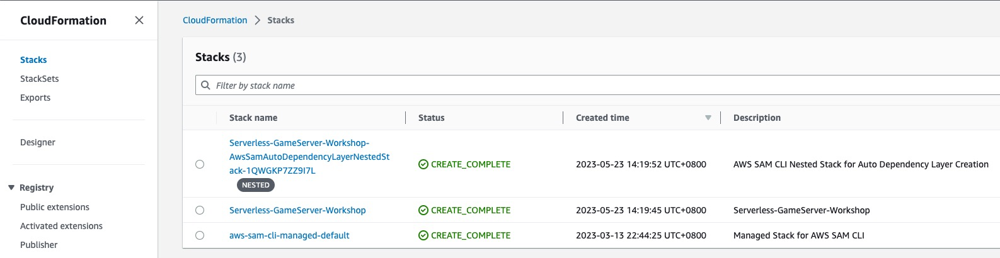


**APIGateway**

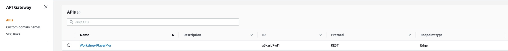

Select the created APIGateway and view the APIGateway's stage.

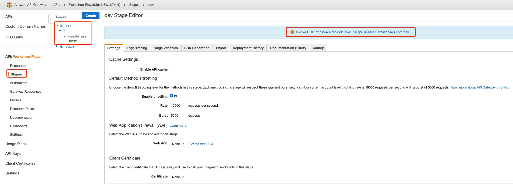

* You can view the created Stage "dev," path "/create_user," and the URL to invoke this APIGateway.


**Lambda**

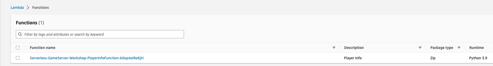

select the Lambda and find the Triggers configuration

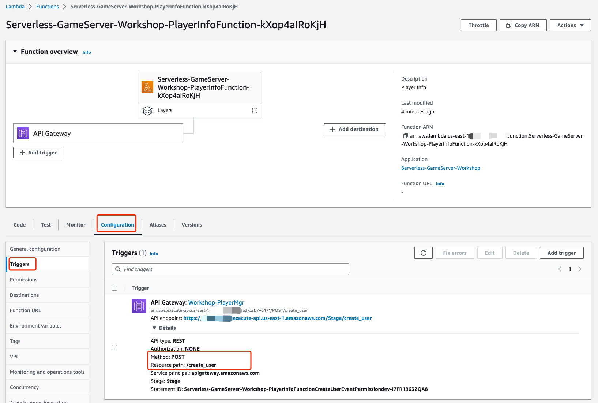

* Lambda function is triggered by invoking the APIGateway with the path "/create_user" that we created.


##### 1.1.5 Test the deployment of the server

Retrieve the APIGateway URL from the APIGateway resource in section 1.1.4. Use curl command or Postman to test if the deployed HTTP server is functioning correctly.

```shell
# Since the event registered in the Lambda function in template.yaml is specifically for the APIGateway post method, other methods will return a 403 Forbidden response. 
curl "https://aabbcc.execute-api.us-east-1.amazonaws.com/dev/create_user"
{"message":"Missing Authentication Token"}%

curl -XPOST "https://aabbcc.execute-api.us-east-1.amazonaws.com/dev/create_user" -H 'Content-Type: application/json' -d '{"user_id":"test_user"}'
{"msg": "create user success"}%
```


##### 1.1.6 Check server log

View the logs of the Lambda function `PlayerInfoFunction` by selecting the log group associated with it in CloudWatch Logs

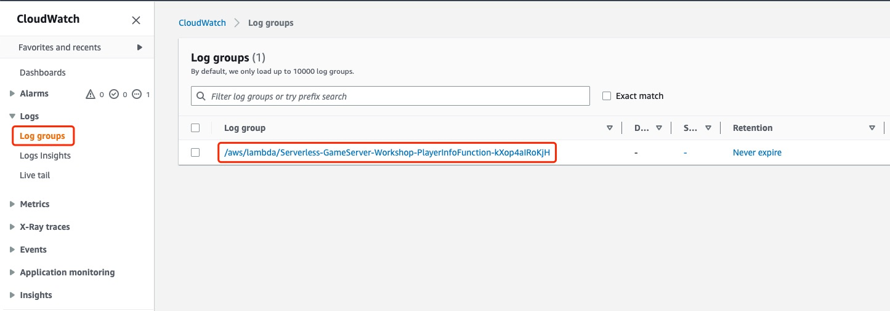

select the latest log stream

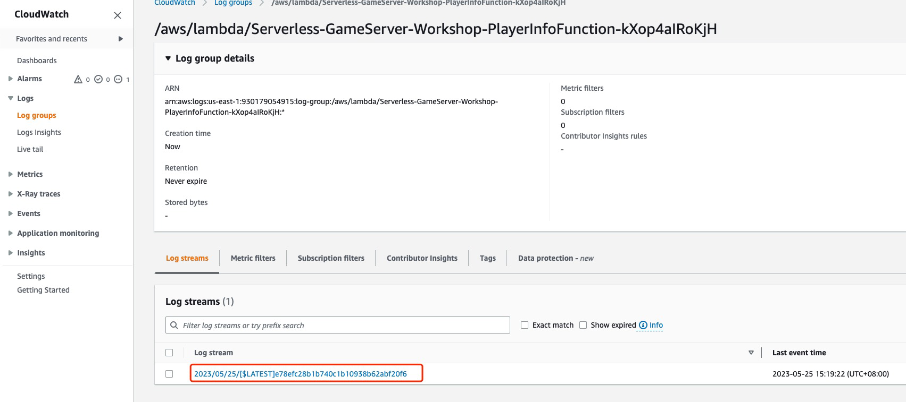

a complete Lambda invocation log

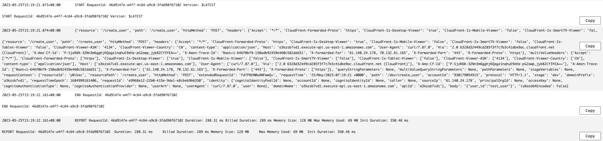

* `START`: The Lambda function has started, showing the `RequestId` and `Version`.
* `{'resource': '/create_user' .....}`: event content, printed in the lambda
* `END`: The Lambda function has finished execution, showing the `RequestId`.
* `REPORT`: Details about the execution duration, billed duration, memory size, and maximum memory used.


**In addition to viewing server logs through the console, you can also use the CLI to monitor server logs in real-time, similar to using the `tail -f` command to monitor logs written to a file during local development**

```shell
aws logs tail /aws/lambda/Serverless-GameServer-Worksho-PlayerInfoFunction-1xgY5j45ekEX --follow
```

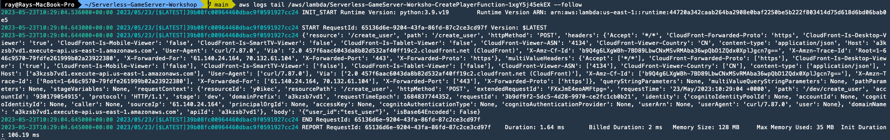


So far, we have deployed an APIGateway + Lambda HTTP "Hello World" using the SAM template. We have also utilized CloudWatch Logs to view the server logs.


#### 1.2 Player Creation Service

##### 1.2.1 Edit template.yaml and add DynamoDB resources

Modify the `template.yaml` file to add DynamoDB resources

```yaml
...
  PlayerInfoTable:
    Type: AWS::DynamoDB::Table
    Properties:
      AttributeDefinitions:
        - AttributeName: "user_id"
          AttributeType: "S" # user_id is string
      KeySchema:
        - AttributeName: "user_id"
          KeyType: "HASH"
      ProvisionedThroughput:
        ReadCapacityUnits: 5
        WriteCapacityUnits: 5
      SSESpecification:
        SSEEnabled: True # Server Side Encryption
      TableName: "player_info" # DDB table name
```

Run `sam sync` to synchronize the resources to the cloud.

```shell
sam sync --stack-name Serverless-GameServer-Workshop
```


##### 1.2.2 Check DynamoDB

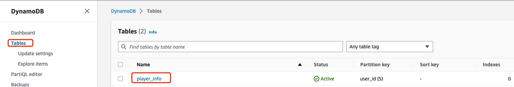

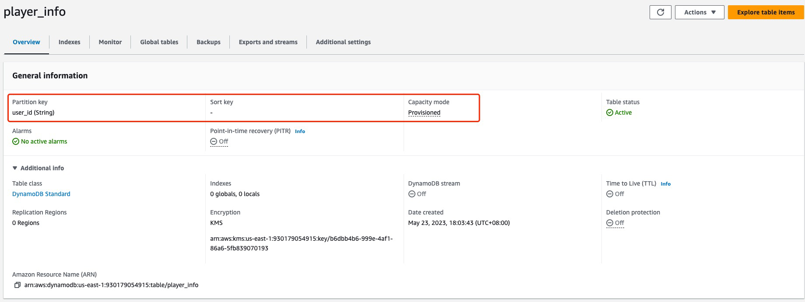


##### 1.2.3 Edit the `~/Serverless-GameServer-Workshop/player-manager/main.py`  and add the logic for `create_user`

Add the global DynamoDB table resource before the `main_handler` method in the code

```python
import json
import boto3

# Get DynamoDB resource with boto3.resource('dynamodb').
# player_info represents the table name, which corresponds to Resources -> PlayerInfoTable -> Properties -> TableName in template.yaml
player_info_table = boto3.resource('dynamodb').Table("player_info")

def main_handler(event, context):
  ...
```

Add a function to check if the `user_id` provided by the client already exists.

```python
import json
import boto3

# Get DynamoDB resource with boto3.resource('dynamodb').
# player_info corresponds to Resources -> PlayerInfoTable -> Properties -> TableName in template.yaml
player_info_table = boto3.resource('dynamodb').Table("player_info")

# check if the user_id exists
def getUserInfo(user_id):
    response = player_info_table.get_item(Key={"user_id": user_id})
    if "Item" in response:
        return response["Item"]
    else:
        return None

def main_handler(event, context):
  ...
```

Modify the `main_handler`  to write player info to DynamoDB.

```python
def main_handler(event, context):
    try:
        print(event)
        path = event.get('path')
        method = event.get('httpMethod')
        event_body = event.get('body')
        event_body = json.loads(event_body if event_body is not None else '{}') # convert body to dict
        if path == "/create_user":
            if method == "POST":
                if "user_id" in event_body and event_body["user_id"] != "":
                    if getUserInfo(event_body["user_id"]) == None:
                        player_info_table.put_item(Item={"user_id": event_body["user_id"]})
                        return { 'statusCode': 200, 'body': json.dumps({"msg": "create user success"}), }
                    else:
                        return { 'statusCode': 400, 'body': json.dumps({"msg": "user_id exists"}), }
                else:
                    return { 'statusCode': 400, 'body': json.dumps({"msg": "empty user_id"}), }
    except Exception as err:
        print(err)
        return { 'statusCode': 500, 'body': json.dumps({"msg": str(err)}) }
```

Run `sam sync` to synchronize the resources to the cloud.

```shell
sam sync --stack-name Serverless-GameServer-Workshop
```


##### 1.2.4 Functional Test

```shell
curl -XPOST "https://aabbcc.execute-api.us-east-1.amazonaws.com/dev/create_user" -H 'Content-Type: application/json' -d '{"user_id":"test_user"}'
{"msg": "An error occurred (AccessDeniedException) when calling the GetItem operation: User: arn:aws:sts::123456789:assumed-role/Serverless-GameServer-Wor-PlayerInfoFunctionRole-1CSMEMP2JLOJ4/Serverless-GameServer-Worksho-PlayerInfoFunction-1xgY5j45ekEX is not authorized to perform: dynamodb:GetItem on resource: arn:aws:dynamodb:us-east-1:123456789:table/player_info because no identity-based policy allows the dynamodb:GetItem action"}%
```

The error log indicates that the Lambda function does not have the necessary permission to execute `dynamodb:GetItem`. You need to add the permission for the Lambda function to interact with AWS resources.


##### 1.2.5 Create IAM Role and associate with the lambda

create role

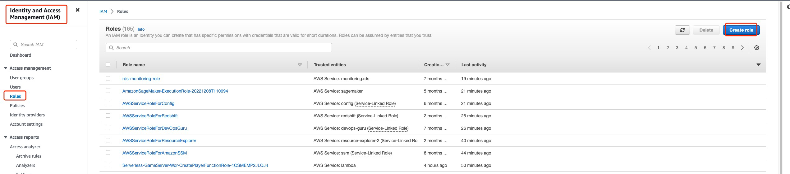

select AWS service for trusted entity type, and select Lambda for Use case

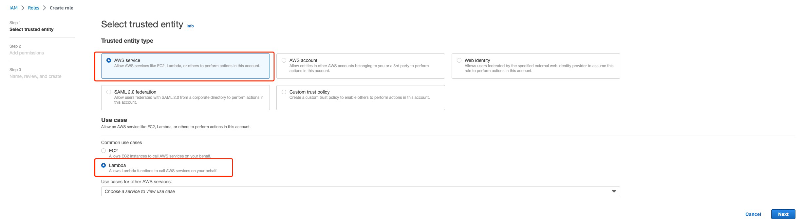

`Administrator` permission does not adhere to the principle of least privilege, just for ease of demo here. 

**It is recommended to set permissions based on the principle of least privilege in your environment**


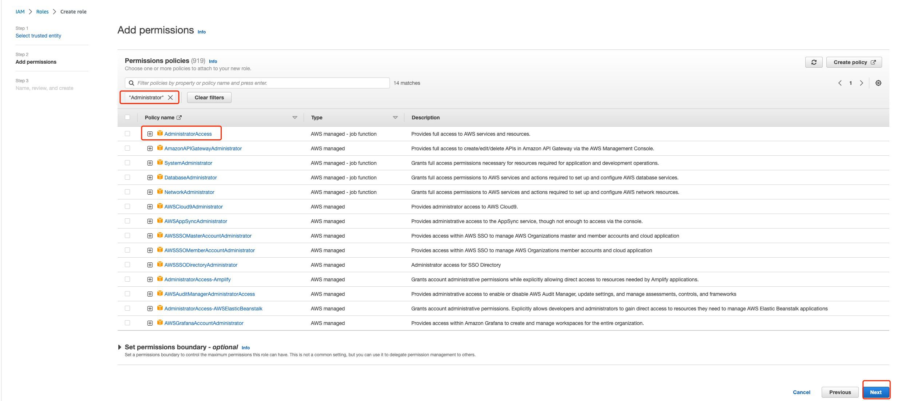

set the  Role name "Workshop-Lambda-Role" 

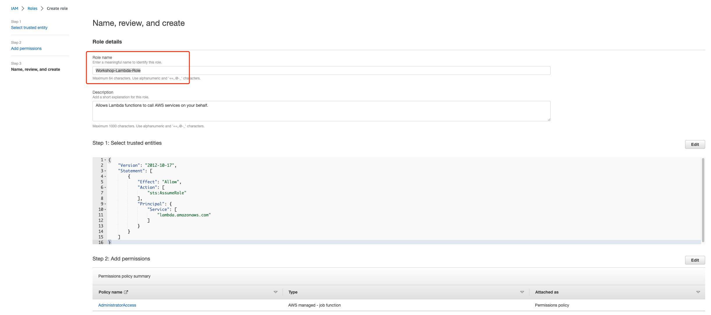

get the ARN of the role we created just now

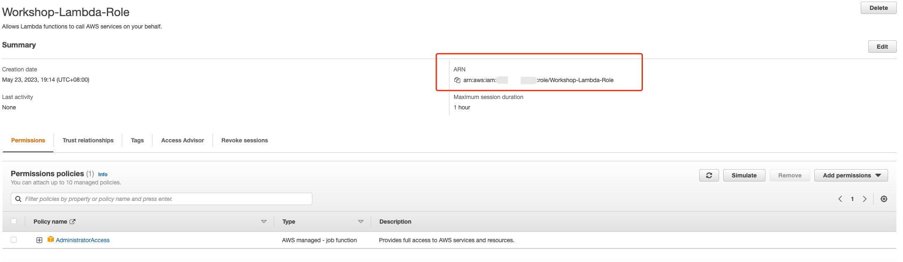

Modify the `template.yaml` file to associate the `Workshop-Lambda-Role` with the Lambda

* Replace `Role` with yours

```yaml
  PlayerInfoFunction:
    Type: AWS::Serverless::Function
    Properties:
      ...
      Role: "arn:aws:iam::123456789:role/Workshop-Lambda-Role"
      Events:
        ...
```

Run `sam sync` to synchronize the resources to the cloud.

```shell
sam sync --stack-name Serverless-GameServer-Workshop
```


##### 1.2.6 Functional Test

```shell
~: curl -XPOST "https://aabbcc.execute-api.us-east-1.amazonaws.com/dev/create_user" -H 'Content-Type: application/json' -d '{"user_id":"test_user"}'
{"msg": "create user success"}%
~: curl -XPOST "https://aabbcc.execute-api.us-east-1.amazonaws.com/dev/create_user" -H 'Content-Type: application/json' -d '{"user_id":"test_user"}'
{"msg": "create user failed: user_id already exists"}%
~: curl -XPOST "https://aabbcc.execute-api.us-east-1.amazonaws.com/dev/create_user" -H 'Content-Type: application/json' -d '{"user_id":""}'
{"msg": "create user failed: empty user_id"}%
~: curl -XPOST "https://aabbcc.execute-api.us-east-1.amazonaws.com/dev/create_user" -H 'Content-Type: application/json'
{"msg": "create user failed: empty user_id"}%
```

After granting the necessary permissions to the Lambda function, it can now execute successfully and perform read and write operations on DynamoDB.


##### 1.2.7 Check datas in the Dynamodb

Use the AWS CLI to view the data that was just written to DynamoDB.

```shell
~: aws dynamodb scan --table-name player_info --no-cli-pager
{
    "Items": [
        {
            "user_id": {
                "S": "test_user"
            }
        }
    ],
    "Count": 1,
    "ScannedCount": 1,
    "ConsumedCapacity": null
}
```


#### 1.3 Player Deletion Service

##### 1.3.1 Edit the `~/Serverless-GameServer-Workshop/player-manager/main.py`  and add the logic for `delete_user` 

```python
def main_handler(event, context):
    try:
        ......
        if path == "/create_user":
            if method == "POST":
                ......
        elif path == "/delete_user": # following code is generated by CodeWhisperer
            if method == "POST":
                if "user_id" in event_body and event_body["user_id"] != "":
                    if getUserInfo(event_body["user_id"]) != None:
                        player_info_table.delete_item(Key={"user_id": event_body["user_id"]})
                        return { 'statusCode': 200, 'body': json.dumps({"msg": "delete user success"}), }
                    else:
                        return { 'statusCode': 400, 'body': json.dumps({"msg": "user_id not exists"}), }
                else:
                    return { 'statusCode': 400, 'body': json.dumps({"msg": "empty user_id"}), }
    except Exception as err:
        ......
```


##### 1.3.2 Modify the `template.yaml` file to enable triggering of the `main_handler` function when accessing the `/delete_user` path in API Gateway.

* Replace `Role` with yours

```yaml
  PlayerInfoFunction:
    Type: AWS::Serverless::Function
    Properties:
      ......
      Role: "arn:aws:iam::123456789:role/Workshop-Lambda-Role"
      Events:
        CreateUserEvent:
          ......
        DeleteUserEvent:
          Type: Api
          Properties:
            Path: /delete_user
            Method: post
            RestApiId: !Ref PlayerMgr
```


Run `sam sync` to synchronize the resources to the cloud

```shell
sam sync --stack-name Serverless-GameServer-Workshop
```


##### 1.3.3 Check resources update

We have added a `DeleteUserEvent` in the `Events` section of the `PlayerInfoFunction` Lambda. The trigger condition is set to the `/delete_user` path in API Gateway. 

Check the updated configuration on the console.

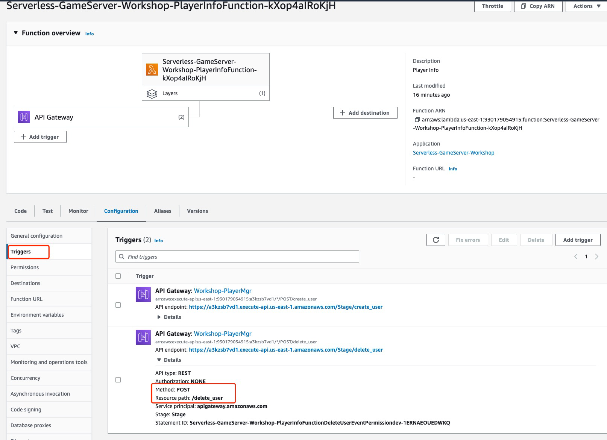


##### 1.3.4 Functional Test

```shell
~: curl -X POST "https://aabbcc.execute-api.us-east-1.amazonaws.com/dev/delete_user" -H 'Content-Type: application/json'
{"msg": "empty user_id"}%
~: curl -X POST "https://aabbcc.execute-api.us-east-1.amazonaws.com/dev/delete_user" -H 'Content-Type: application/json' -d '{"user_id":"test_user"}'
{"msg": "delete user success"}%
~: curl -X POST "https://aabbcc.execute-api.us-east-1.amazonaws.com/dev/delete_user" -H 'Content-Type: application/json' -d '{"user_id":"test_user"}'
{"msg": "user_id not exists"}
```


Greate, it works.


### 2. Client Deployment

In this workshop, the client is an HTML5 application exported from the Godot Engine. It runs in a web browser and does not require any client-side development.

You just need to configure the APIGateway URL deployed by SAM in the previous steps.

<span style="color:red">Please note that the client application is not the focus of this workshop, and it is for demonstration purposes only. It may have bugs, so your feedback is welcome.</span>

<span style="color:red">The game client in this workshop is developed from a great open source project [Circle_Jump](https://github.com/kidscancode/circle_jump)</span>


#### 2.1 Start Game Client

Start a HTTP server in the GameClient directory, please refer to the "Getting Started" section for GameClient download.

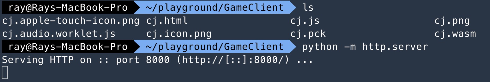

access localhost:8000/cj.html

 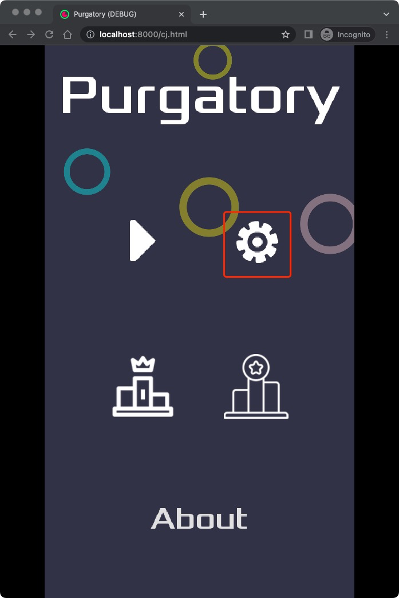


#### 2.2 Configure Serverlist 

Usually, game clients get serverlist file through a HTTP service. However, we configure our server addresses manually for demonstrate.

 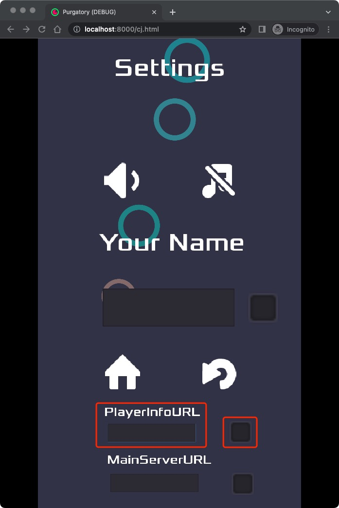


Here, you can see three configuration options:

* PlayerInfoURL: The HTTP server address, currently used only for setting the player's name.
* MainServerURL: The WebSocket server address used for implementing game features such as matchmaking, battles, and settlement.
* Player Name: The player's name, which can be set only after configuring the PlayerInfoURL to send a request to the server for user creation.

Fill in the PlayerInfoURL field with the dev stage address of the APIGateway obtained in section 1.1.5. 

Click on the square on the right to confirm. At this point, the client will write a configuration file locally to store the configured PlayerInfoURL, which will be read each time the client is launched.


#### 2.3 Test Player Service

Enter the player's name, click on the square on the right to confirm

 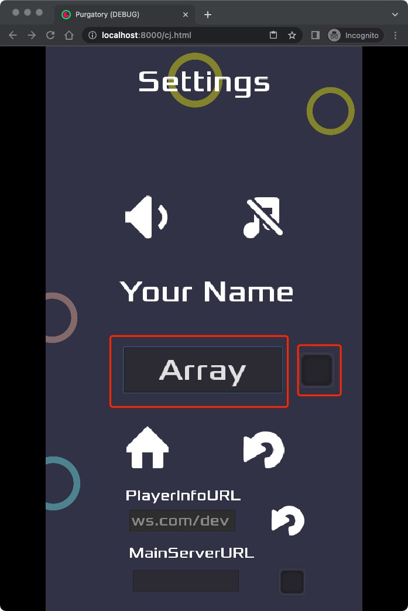

**After clicking on the square to confirm, the client will:**

1.  send an HTTP POST request to "https://$PLAYERMGR_URL/create_user" with the JSON body `{"user_id": $user_name}`.
1. $PLAYERMGR_URL is the configured GameServer address, user_name is the entered content
1. After receiving a successful response from the server, the client will create a file called "player_name.save" locally to store the player's name. In subsequent runs, if the client detects the presence of "player_name.save" file, it will use the stored player name from the file. When making requests, the client will include the "user_id" along with the player name.


No response received. Open the developer console to view the runtime logs.

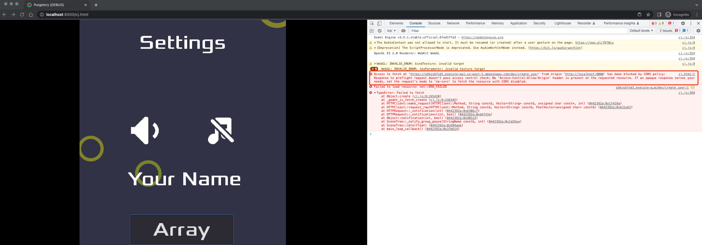

It seems that the server is blocking requests from the local HTML5 client due to CORS (Cross-Origin Resource Sharing) restrictions.


**So far, although the player creation service is not fully functional yet, the deployment configuration for the client is complete. To modify the server to support CORS, please refer to the next chapter.**


### 3. Support CORS

To enable CORS for APIGateway + Lambda, you can refer to the documentation on [Enabling CORS for a REST API resource](https://docs.aws.amazon.com/apigateway/latest/developerguide/how-to-cors.html). The following requirements need to be met:

1. For CORS requests, an OPTIONS request is sent to APIGateway first. If the request is allowed, then the POST request is sent.
2. Both the OPTIONS and POST responses need to include specific headers.

In this workshop, we will do the following changes to support CORS :

1. Add the OPTIONS method to all paths in APIGateway.
2. Add the required headers to all HTTP responses.


#### 3.1 Register OPTIONS Method

Edit the `template.yaml` file

```yaml
  PlayerInfoFunction:
    Type: AWS::Serverless::Function
    Properties:
      ......
      Events:
        CreateUserEvent:
          ...
        DeleteUserEvent:
          ...
        CreateUserOptionsEvent:
          Type: Api
          Properties:
            Path: /create_user
            Method: options
            RestApiId: !Ref PlayerMgr
        DeleteUserOptionsEvent:
          Type: Api
          Properties:
            Path: /delete_user
            Method: options
            RestApiId: !Ref PlayerMgr
```

Edit the `main_handler` function to include required headers in the response for both POST and OPTIONS requests.

```python
import json
import boto3
...
# requried headers to support CORS
headers = {
    'Access-Control-Allow-Origin': '*',
    'Access-Control-Allow-Methods': 'POST,OPTIONS',
    'Access-Control-Allow-Headers':'Content-Type,Access-Control-Allow-Origin,Access-Control-Allow-Methods,Access-Control-Allow-Headers',
}
...
def main_handler(event, context):
    try:
        print(event)
        path = event.get('path') 
        method = event.get('httpMethod')
        event_body = event.get('body')
        event_body = json.loads(event_body if event_body is not None else '{}')
        if path == "/create_user":
            if method == "POST":
                if "user_id" in event_body and event_body["user_id"] != "":
                    if getUserInfo(event_body["user_id"]) == None:
                        player_info_table.put_item(Item={"user_id": event_body["user_id"]})
                        return { 'statusCode': 200, 'headers': headers, 'body': json.dumps({"msg": "create user success"}), }
                    else:
                        return { 'statusCode': 400, 'headers': headers, 'body': json.dumps({"msg": "user_id exists"}), }
                else:
                    return { 'statusCode': 400, 'headers': headers, 'body': json.dumps({"msg": "empty user_id"}), }
            elif method == "OPTIONS":
                return { 'statusCode': 200, 'headers': headers, 'body': json.dumps({"msg": "options success"}), }
        elif path == "/delete_user":
            if method == "POST":
                if "user_id" in event_body and event_body["user_id"] != "":
                    if getUserInfo(event_body["user_id"]) != None:
                        player_info_table.delete_item(Key={"user_id": event_body["user_id"]})
                        return { 'statusCode': 200, 'headers': headers, 'body': json.dumps({"msg": "delete user success"}), }
                    else:
                        return { 'statusCode': 400, 'headers': headers, 'body': json.dumps({"msg": "user_id not exists"}), }
                else:
                    return { 'statusCode': 400, 'headers': headers, 'body': json.dumps({"msg": "empty user_id"}), }
            elif method == "OPTIONS":
                return { 'statusCode': 200, 'headers': headers, 'body': json.dumps({"msg": "options success"}), }
    except Exception as err:
        print(err)
        return { 'statusCode': 500, 'headers': headers, 'body': json.dumps({"msg": str(err)}) }
```

Run `sam sync` to synchronize the resources to the cloud.

```shell
sam sync --stack-name Serverless-GameServer-Workshop
```


#### 3.2 Game client Functional Test

Player Creation

 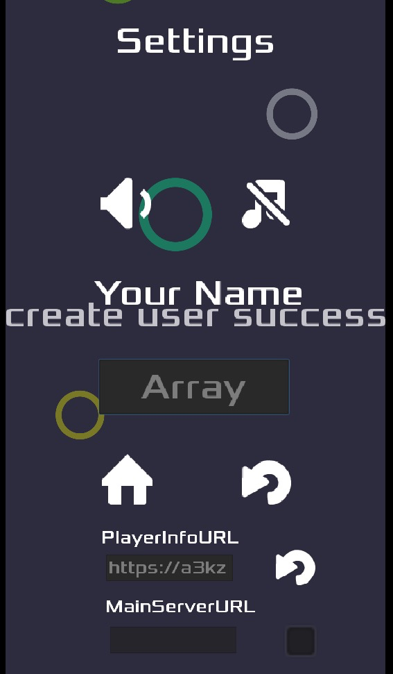


Player Deletion

 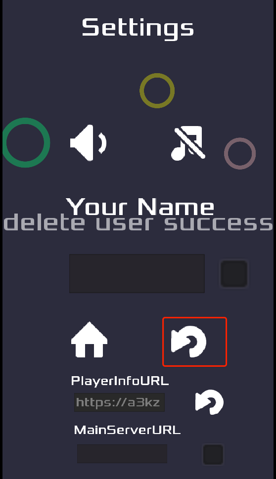


### Lab1 Summary

Congratulations on completing Lab 1! 

In Lab 1, we accomplished the following tasks:

1. Deployed an HTTP server using SAM to provide player creation and deletion service.
2. Configured the Serverlist to enable communication between the client and the SAM-deployed server.
3. Modified the server to enable CORS support, allowing interaction with HTML5 applications.

In Lab 2, we will implement a WebSocket service to enable in-game multiplayer matchmaking and battle.
