[TOC]

## Lab2: MatchMaking and Battle Service

### 0. Instruction

<span style="color:red">**The  code in the Workshop is only a functional demonstration of the serverless development. It is not a best practice for business development. The actual server development needs to comprehensively consider performance, scalability, reliability, cost, and security.**</span>


In this lab, we will develop a WebSocket service to enable matchmaking and gameplay within the game.

In Lab 1, we developed a serverless HTTP service using SAM for player creation and deletion.

After creating a player in the HTML5 page, you may have noticed that the client attempted to connect to a WSS (WebSocket Secure) address automatically. 

However, since we didn't configure a WSS address, the connection was closed.

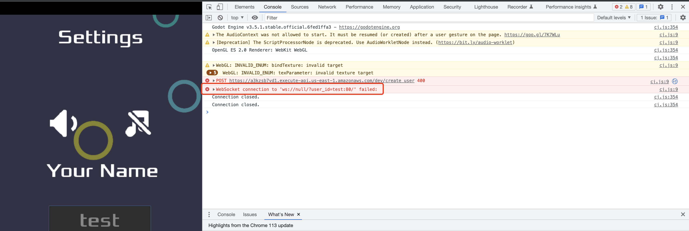


In this lab, we will implement a WebSocket service for matchmaking and battle.


### 1. Websocket Hello world


#### 1.1 Create Lambda in SAM template.yaml

Edit `template.yaml` file in the Lab1, add Lambda resources

* Replace Role with yours

```yaml
......
Resources:

	###--- HTTP Service ---###
  ......
  ###--- Websocket Service ---###       
  MainServerFunction:
    Type: AWS::Serverless::Function
    Properties:
      Description: 'Handle all connections'
      CodeUri: main-server/
      Handler: main.main_handler
      Runtime: python3.9
      Architectures:
        - arm64
      Role: "arn:aws:iam::1234567890:role/Workshop-Lambda-Role"
```

* Here, we have created a standalone Lambda function resource without configuring any events to trigger it, unlike the HTTP service in Lab 1
* In the next steps, we will define method to reference this Lambda function from other resources.


#### 1.2 Develop lambda function

Create a directory named `main-server` in the same directory as template.yaml.

The directory name should correspond to the `Resources.MainServerFunction.Properties.CodeUri` configuration in template.yaml.

Create a file named `main.py` in the `~/Serverless-GameServer-Workshop/main-server` directory. In the main.py file, add a method named `main_handler`, which should correspond to the `Resources.MainServerFunction.Properties.Handler` configuration in template.yaml.

~/Serverless-GameServer-Workshop/main-server/main.py

```python
import json
import random
import string

def main_handler(event, context):
    try:
        print(event)
        # get routeKey
        route_key = event.get('requestContext', {}).get('routeKey')

        # Get connectionId，for each WebSocket connection，API Gateway will assign a connectionId
        # connectionId is used for communication between client and server
        connection_id = event.get('requestContext', {}).get('connectionId')
        event_body = event.get('body')
        event_body = json.loads(event_body if event_body is not None else '{}')

        if route_key is None or connection_id is None:
            return {'statusCode': 400, 'body': 'routeKey or connectionId is None'}

        # Handle on connect
        if route_key == '$connect':
            # if connectionId is not included in the query string, generate a random one
            tmp_guest_user_id = ''.join(random.choices(string.ascii_uppercase+string.digits, k=12))
            user_id = event.get('queryStringParameters', {'user_id': tmp_guest_user_id}).get('user_id')
            print(f"connect user_id: {user_id}, connection_id: {connection_id}") # print user_id and connection_id, so we can find that in CloudWatch Log
            return {'statusCode': 200}

        # Handle on disconnect
        elif route_key == '$disconnect':
            print(f"disconnect connection_id: {connection_id}") 
            return {'statusCode': 200}
        else:
            print("routeKey '%s' not registered" % event_body["action"])
            return {'statusCode': 400}

    except Exception as err:
        print(err)
        return {'statusCode': 500}
```


#### 1.3 Exposing a Lambda function with API Gateway resources.

Edit  `template.yaml`, add following resources

```yaml
......
Resources:

	###--- HTTP Service ---###
  ......
  ###--- Websocket Service ---### 
  # APIGateway of MainServer Websocket
  MainEntry:
    Type: AWS::ApiGatewayV2::Api
    Properties:
      Name: Workshop-MainEntry
      ProtocolType: WEBSOCKET
      RouteSelectionExpression: "$request.body.action"
  # Stage of the APIGateway
  Stage:
    Type: AWS::ApiGatewayV2::Stage
    Properties:
      StageName: dev
      Description: "dev env"
      ApiId: !Ref MainEntry
  MainServerFunction:
    ......
  # Integration API Gateway with Lambda
  MainServerIntegration:
    Type: AWS::ApiGatewayV2::Integration
    Properties:
      ApiId: !Ref MainEntry
      IntegrationType: AWS_PROXY
      IntegrationUri: !Join
        - ''
        - - 'arn:'
          - !Ref AWS::Partition
          - ':apigateway:'
          - !Ref AWS::Region
          - ':lambda:path/2015-03-31/functions/'
          - !GetAtt MainServerFunction.Arn
          - '/invocations'
  
  # Default APIGateway route
  DefaultRoute:
    Type: AWS::ApiGatewayV2::Route
    Properties:
      ApiId: !Ref MainEntry
      RouteKey: "$default"
      AuthorizationType: NONE
      OperationName: DefaultRoute
      Target: !Join
        - '/'
        - - 'integrations'
          - !Ref MainServerIntegration

  # route on connect
  ConnectRoute:
    Type: AWS::ApiGatewayV2::Route
    Properties:
      ApiId: !Ref MainEntry
      RouteKey: "$connect"
      AuthorizationType: NONE
      OperationName: ConnectRoute
      Target: !Join
        - '/'
        - - 'integrations'
          - !Ref MainServerIntegration

  # route on disconnect
  DisconnectRoute:
    Type: AWS::ApiGatewayV2::Route
    Properties:
      ApiId: !Ref MainEntry
      RouteKey: "$disconnect"
      AuthorizationType: NONE
      OperationName: DisconnectRoute
      Target: !Join
        - '/'
        - - 'integrations'
          - !Ref MainServerIntegration
```

Run `sam sync` to synchronize the resources to the cloud.

```shell
sam sync --stack-name Serverless-GameServer-Workshop
```


#### 1.1.4 Check resource creation

Check APIGateway and Lambda created by SAM in the console

**APIGateway**

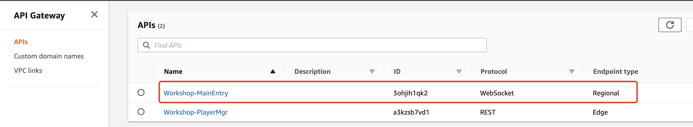

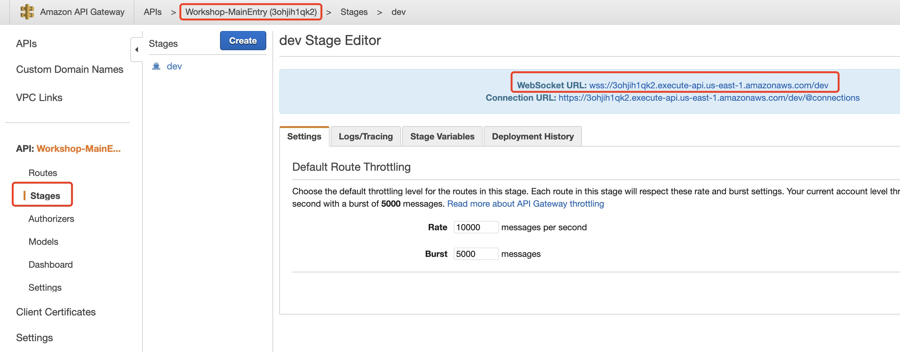

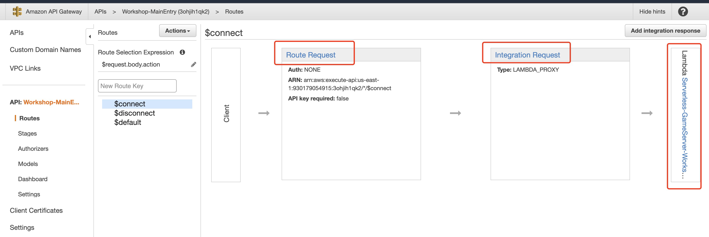

* Forwading client requests to the lambda with APIGateway Integration


**Lambda**

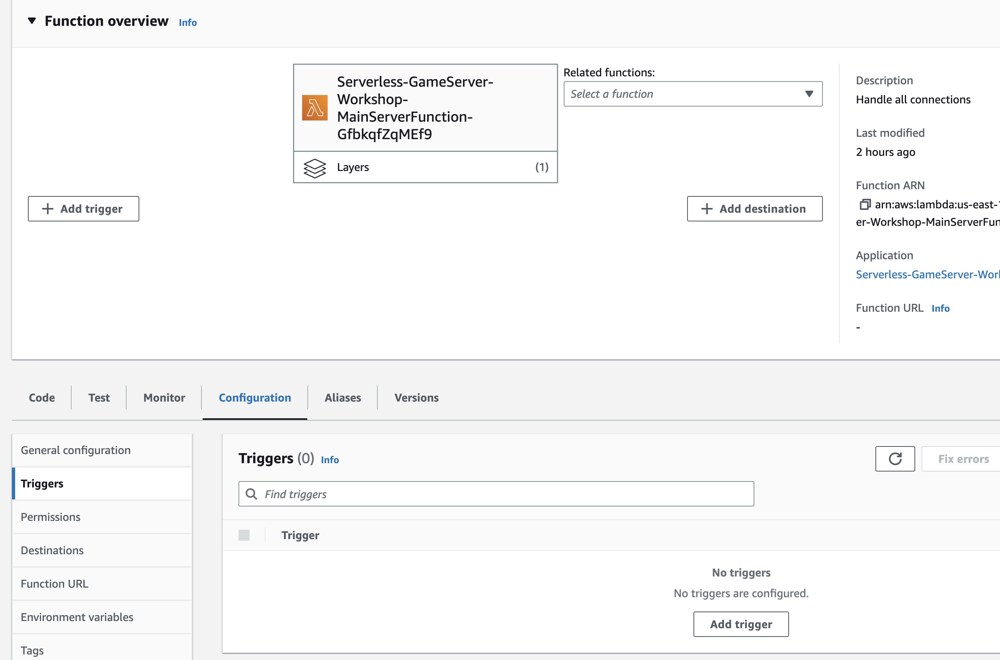

* You can see that the Events property is not configured in the Lambda resource, and the Lambda trigger is empty in the console.
* This Lambda function is connected to the API Gateway using an API Gateway Integration.


#### 1.5 Test websocket service with wscat

connect to APIGateway with wscat command

```shell
~: wscat -c wss://aabbcc.execute-api.us-east-1.amazonaws.com/dev
error: Unexpected server response: 403
> %
```

* Get 403 response


Check APIGateway Deployment

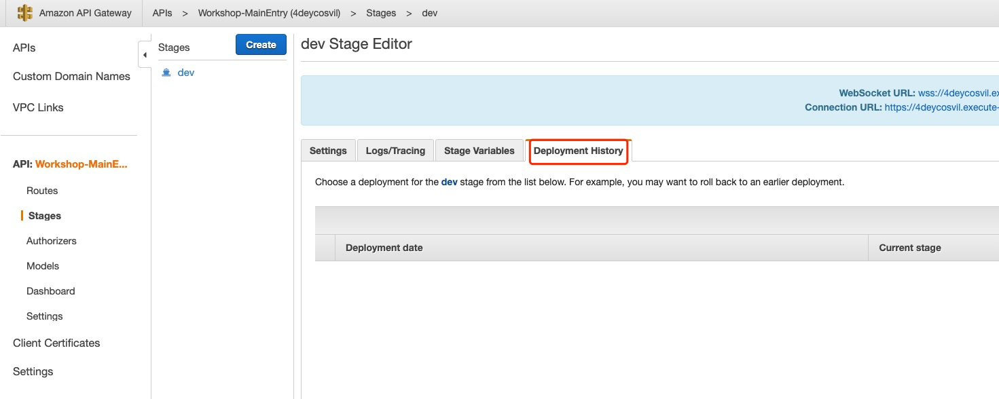

* Deployment is empty，APIGateway is not deployed yet

#### 1.6 Deploy API Gateway and Test Websocket Service

Edit `template.yaml`, add the `AutoDeploy` property to the `Resources.Stage.Properties`

```yaml
Resources:
......
  Stage:
    Type: AWS::ApiGatewayV2::Stage
    Properties:
      StageName: dev
      Description: "dev env"
      ApiId: !Ref MainEntry
      AutoDeploy: true
```

* After adding the `AutoDeploy` property to the `Stage` resource, any changes made to the stage will automatically trigger a deployment, and you can access the updated API Gateway + Lambda using the URL of the stage.

Run `sam sync` to synchronize the resources to the cloud.

```shell
sam sync --stack-name Serverless-GameServer-Workshop
```

Check the result

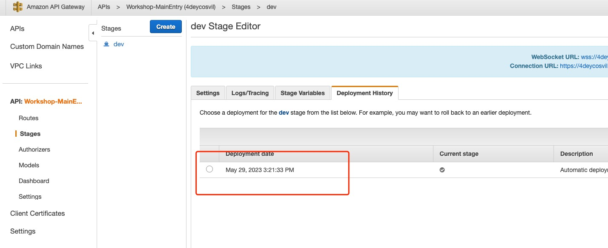

connect to the API Gateway with wscat command

```shell
~: wscat -c wss://aabbcc.execute-api.us-east-1.amazonaws.com/dev
error: Unexpected server response: 500
> %
```

* got 500 response


#### 1.7 Enable APIGateway Execution Log for troubleshooting

##### 1.7.1 Enable APIGateway Execution Logs

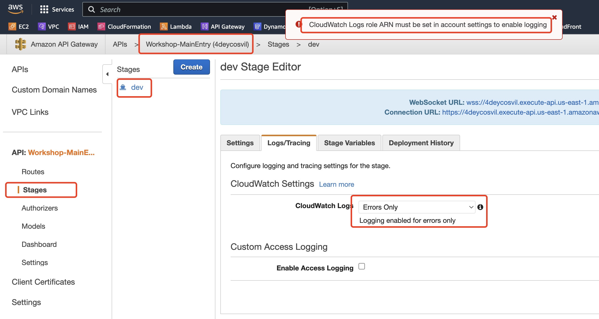

* Configure the necessary role for API Gateway to write logs to CloudWatch Logs before enbale API Gateway execution logs


##### 1.7.2 Create IAM Role and associate with the API Gateway

**Create role**

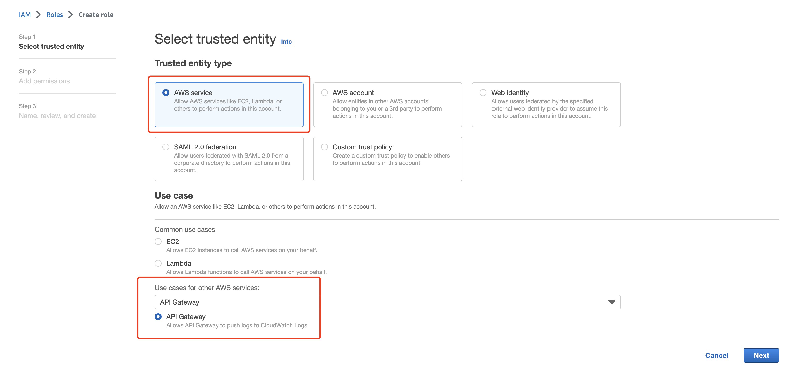

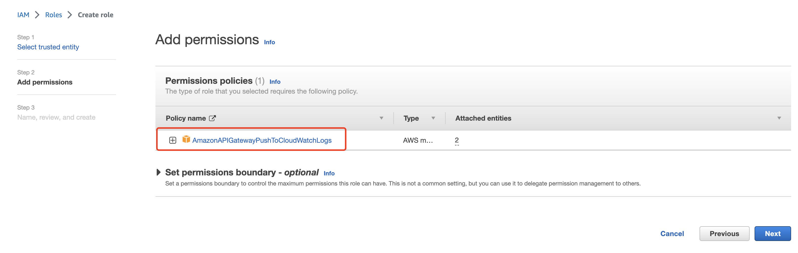

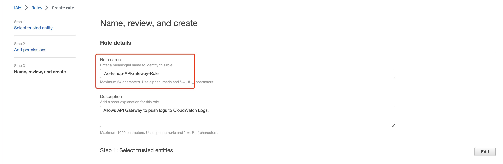

**associate the role with API Gateway**


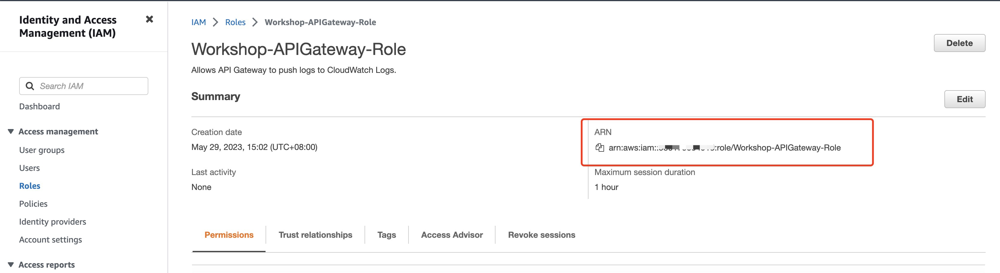


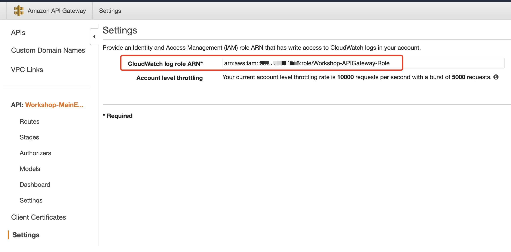

##### 1.7.3 Enable APIGateway Execution Log

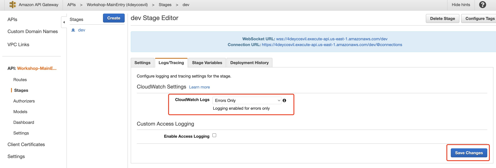

##### 1.7.4 connect to Websocket service again

```
~: wscat -c wss://aabbcc.execute-api.us-east-1.amazonaws.com/dev
error: Unexpected server response: 500
> %
```

**it may take about 2min to see the first log entry**

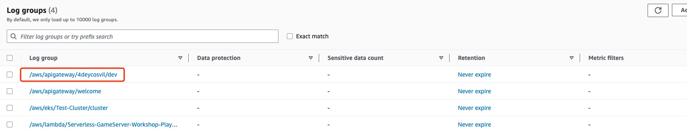

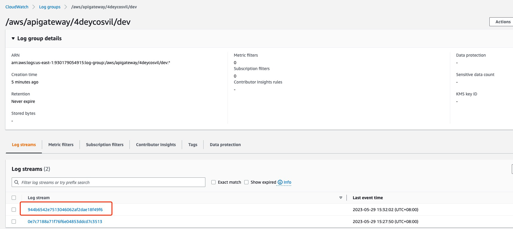

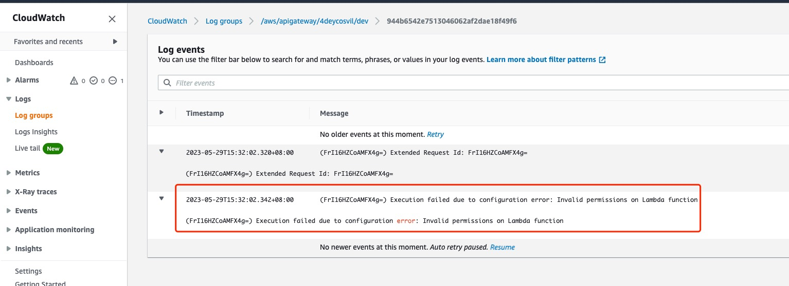

* **we got the problem, API Gateway didn't have nacessary permission to invoke lambda **


#### 1.8 configure Resource-based policy for lambda

we can compare the permission configuration between lambdas in Lab1 and Lab2

**Lab1**

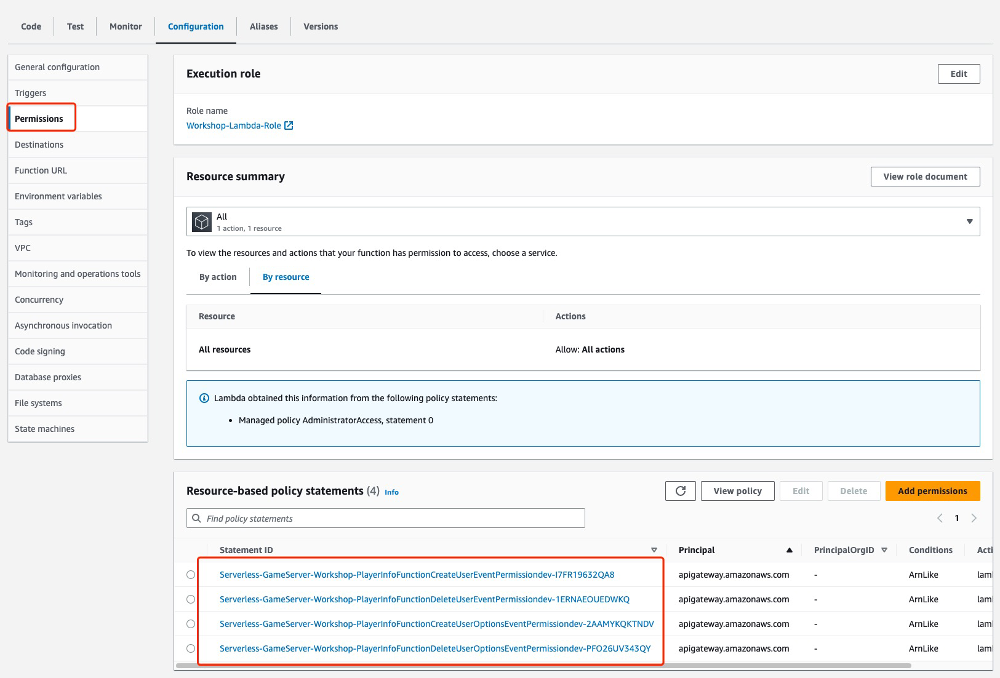

**Lab2**

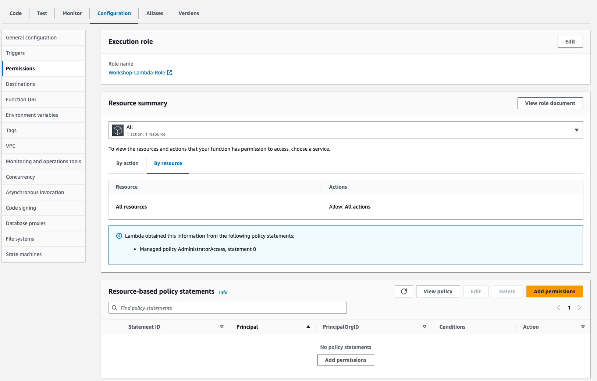

* lambda in Lab1 created the resource-based policy because it configured event trigger
* lambda in Lab2 is a standalone resource without event trigger, no resource-based policy associated with it, as a result APIGateway cannot invoke the lambda

Edit `template.yaml`, add permission to the lambda

```yaml
......
Resources:

	###--- HTTP Service ---###
  ......
  ###--- Websocket Service ---### 
  ......
  MainServerPermission:
    Type: AWS::Lambda::Permission
    DependsOn:
      - MainEntry
    Properties:
      Action: lambda:InvokeFunction
      FunctionName: !Ref MainServerFunction
      Principal: apigateway.amazonaws.com
```

Run `sam sync` to synchronize the resources to the cloud.

```shell
sam sync --stack-name Serverless-GameServer-Workshop
```

Check the result

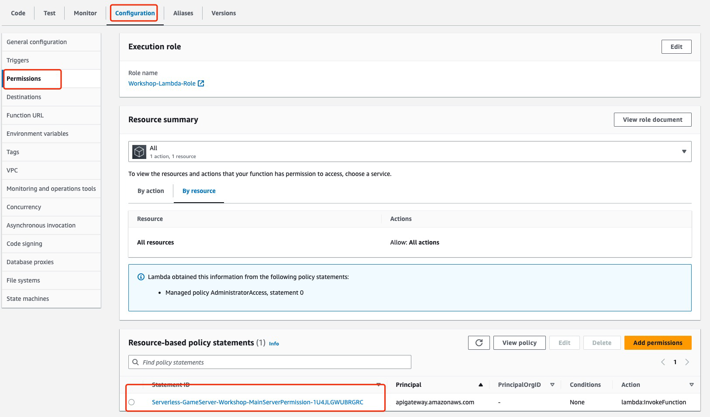


#### 1.8 Test Websocket Hello World

connect the APIGateway with wscat command

```shell
~: wscat -c wss://aabbcc.execute-api.us-east-1.amazonaws.com/dev
Connected (press CTRL+C to quit)
> %
~:
```

Check the log of Websocket Lambda (the log group is different from the PlayerInfo's)

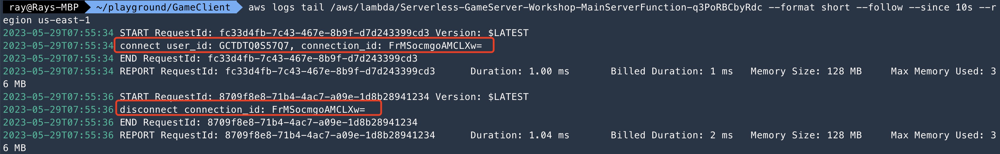

* there's no user_id query string in wss URL, so the server created a random user_id for the connection

connect the APIGateway with wscat command

```shell
~: wscat -c "wss://aabbcc.execute-api.us-east-1.amazonaws.com/dev?user_id=testuser"
Connected (press CTRL+C to quit)
> %
~:
```

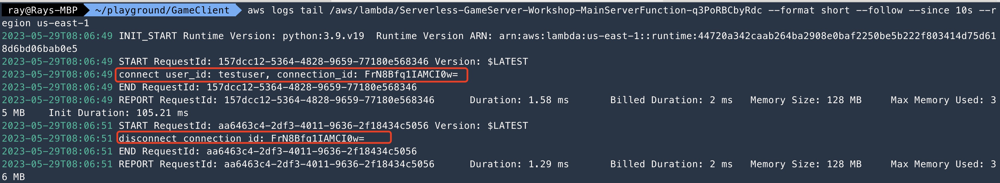

So far, we have finished deploying the Websocket Hello World

### 2. Manage Connection with Dynamodb

In this section, we will use DynamoDB to store the mapping between connection_id and user_id:

1. Data transmission between client and server relies on connection_id
2. user_id is the unique ID of each user
3. Server use the mapping of connection_id and user_id to send data to different user


#### 2.1 Create Dynamodb table to store the mapping between connection_id and user_id

Edit `template.yaml`, add Dynamodb resource just like Lab1

```yaml
......
Resources:

	###--- HTTP Service ---###
  ......
  ###--- Websocket Service ---### 
  ......
  MainServerTable:
    Type: AWS::DynamoDB::Table
    Properties:
      AttributeDefinitions:
        - AttributeName: "connection_id"
          AttributeType: "S"
      KeySchema:
        - AttributeName: "connection_id"
          KeyType: "HASH"
      ProvisionedThroughput:
        ReadCapacityUnits: 5
        WriteCapacityUnits: 5
      SSESpecification:
        SSEEnabled: True
      TableName: "main_server"
```

Edit `~/Serverless-GameServer-Workshop/main-server/main.py`, modify the handler

```python
......
import boto3
# main_server corresponds to Resources -> MainServerTable -> Properties -> TableName in template.yaml
main_server_table = boto3.resource('dynamodb').Table("main_server")

def main_handler(event, context):
    try:
      	....
        if route_key == '$connect':
            tmp_guest_user_id = ''.join(random.choices(string.ascii_uppercase+string.digits, k=12))
            user_id = event.get('queryStringParameters', {'user_id': tmp_guest_user_id}).get('user_id')
            main_server_table.put_item(Item={'user_id': user_id, 'connection_id': connection_id})
            print(f"connect user_id: {user_id}, connection_id: {connection_id}")
            return {'statusCode': 200}

        # Handle on disconnect
        elif route_key == '$disconnect':
            main_server_table.delete_item(Key={'connection_id': connection_id})
            print(f"disconnect connection_id: {connection_id}") 
            return {'statusCode': 200}
        else:
            print("routeKey '%s' not registered" % event_body["action"])
            return {'statusCode': 400}

    except Exception as err:
        print(err)
        return {'statusCode': 500}
```

* when clients connect to the websocket server, the connection_id assigned by APIGateway  and user_id map will be written to Dynamodb
* when clients disconnect, the map will be deleted

Run `sam sync` to synchronize the resources to the cloud.

```shell
sam sync --stack-name Serverless-GameServer-Workshop
```


#### 2.2 Functional Test

connect the APIGateway with wscat command

````shell
~: wscat -c "wss://aabbcc.execute-api.us-east-1.amazonaws.com/dev?user_id=testuser"
Connected (press CTRL+C to quit)
````

check the data in Dynamodb

```shell
aws dynamodb scan --table-name main_server --no-cli-pager
{
    "Items": [
        {
            "connection_id": {
                "S": "FrTaecIHoAMCFGA="
            },
            "user_id": {
                "S": "testuser"
            }
        }
    ],
    "Count": 1,
    "ScannedCount": 1,
    "ConsumedCapacity": null
}
```

Check the data in Dynamodb after disconnection

```shell
aws dynamodb scan --table-name main_server --no-cli-pager
{
    "Items": [],
    "Count": 0,
    "ScannedCount": 0,
    "ConsumedCapacity": null
}
```


### 3. Matchmaking Service

#### 3.1 Develop the machmaking framework

The gameplay for this workshop game is a 1v1 battle, with a First-In-First-Out (FIFO) matchmaking strategy:

1. Player A start Matchmaking:
   1. If there are no players currently waiting for a match, Player A creates a new room and waits for a match
   2. If there is a player Z currently waiting for a match, Player A joins Player Z's room, and a match is established
2. While waiting for a match, Player A can exit the room, which will result in the empty room being destroyed


we will use SAM template to create following resources to implement the matchmaking:

* 1 lambda function (RoomMgrFuction), handle the logic of entering, exiting and destroying the room (we only develop the joinroom logic in this workshop, you can develop the other two yourself)
* 3 APIGateway routes (joinroom, exitroom, destroyroom), receive requests from clients to enter, exit and destroy rooms
* 1 APIGateway integration, associate the route with lambda
* 1 lambda permission, for APIGateway to invoke lambda
* 1 Dynamodb, data store

Edit `template.yaml`

* Role：replace with yours

```yaml
......
Resources:

	###--- HTTP Service ---###
  ......
  ###--- Websocket Service ---### 
  ......
  # Room Manager function
  RoomMgrFunction:
    Type: AWS::Serverless::Function
    Properties:
      Description: 'Battle room service'
      CodeUri: room-manager/
      Handler: main.main_handler
      Runtime: python3.9
      Architectures:
        - arm64
      Role: "arn:aws:iam::123456789:role/Workshop-Lambda-Role"

  # Associate APIGateway with Lambda
  RoomMgrIntegration:
    Type: AWS::ApiGatewayV2::Integration
    Properties:
      ApiId: !Ref MainEntry
      IntegrationType: AWS_PROXY
      IntegrationUri: !Join
        - ''
        - - 'arn:'
          - !Ref AWS::Partition
          - ':apigateway:'
          - !Ref AWS::Region
          - ':lambda:path/2015-03-31/functions/'
          - !GetAtt RoomMgrFunction.Arn
          - '/invocations'

  JoinRoomRoute:
    Type: AWS::ApiGatewayV2::Route
    Properties:
      ApiId: !Ref MainEntry
      RouteKey: "joinroom"
      AuthorizationType: NONE
      OperationName: JoinRoomRoute
      Target: !Join
        - '/'
        - - 'integrations'
          - !Ref RoomMgrIntegration

  ExitRoomRoute:
    Type: AWS::ApiGatewayV2::Route
    Properties:
      ApiId: !Ref MainEntry
      RouteKey: "exitroom"
      AuthorizationType: NONE
      OperationName: ExitRoomRoute
      Target: !Join
        - '/'
        - - 'integrations'
          - !Ref RoomMgrIntegration

  DestroyRoomRoute:
    Type: AWS::ApiGatewayV2::Route
    Properties:
      ApiId: !Ref MainEntry
      RouteKey: "destroyroom"
      AuthorizationType: NONE
      OperationName: DestroyRoomRoute
      Target: !Join
        - '/'
        - - 'integrations'
          - !Ref RoomMgrIntegration
  
  # Allow APIGateway to invoke Lambda
  RoomMgrPermission:
    Type: AWS::Lambda::Permission
    DependsOn:
      - MainEntry
    Properties:
      Action: lambda:InvokeFunction
      FunctionName: !Ref RoomMgrFunction
      Principal: apigateway.amazonaws.com

  # Data store
  CommonResourceTable:
    Type: AWS::DynamoDB::Table
    Properties:
      AttributeDefinitions:
        - AttributeName: "resource_name"
          AttributeType: "S"
      KeySchema:
        - AttributeName: "resource_name"
          KeyType: "HASH"
      ProvisionedThroughput:
        ReadCapacityUnits: 5
        WriteCapacityUnits: 5
      SSESpecification:
        SSEEnabled: True
      TableName: "common_resources"
```


In the same directory as `template.yaml`, create a directory named `room-manager`. This corresponds to the `Resources.RoomMgrFunction.Properties.CodeUri`  in `template.yaml`.

Create a `main.py` in  `~/Serverless-GameServer-Workshop/room-manager` directory. Add the `main_handler` method to the `main.py` , which corresponds to the `Resources.RoomMgrFunction.Properties.Handler` configuration in `template.yaml`.

~/Serverless-GameServer-Workshop/room-manager/main.py

```python
import json

def main_handler(event, context):
    try:
        # Validate request parameters
        route_key = event.get('requestContext', {}).get('routeKey')
        connection_id = event.get('requestContext', {}).get('connectionId')
        event_body = event.get('body')
        event_body = json.loads(event_body if event_body is not None else '{}')

        if route_key is None or connection_id is None:
            return {'statusCode': 400}

        if route_key == 'joinroom':
            print('test joinroom')
            return {'statusCode': 200}

        if route_key == 'exitroom':
            print('test exitroom')
            return {'statusCode': 200}

        if route_key == 'destroyroom':
            print('test destroyroom')
            return {'statusCode': 200}

    except Exception as err:
        print(err)
        return {'statusCode': 500}
```

Run `sam sync` to synchronize the resources to the cloud.

```shell
sam sync --stack-name Serverless-GameServer-Workshop
```


#### 3.2 Functional Test

Test the registered route_key with wscat

```shell
wscat -c "wss://aabbcc.execute-api.us-east-1.amazonaws.com/dev?user_id=testuser"
Connected (press CTRL+C to quit)
> {"action":"joinroom"}
> {"action":"exitroom"}
```

check the log

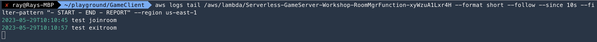


#### 3.3 joinroom service

Edit `~/Serverless-GameServer-Workshop/room-manager/main.py`

Some helper functions：

* Replace endpoint_url with yours

```python
......
import boto3

main_server_table = boto3.resource('dynamodb').Table('main_server')
common_resources_table = boto3.resource('dynamodb').Table('common_resources')

# get user_id from connection_id
def getUserIDFromConnID(connection_id):
    item_response = main_server_table.get_item(Key={'connection_id': connection_id})
    if 'Item' in item_response:
        user_id = item_response['Item']['user_id']
    else:
        user_id = None
    return user_id

# get connection_id from user_id
# we use iteration here, you should use indexes in your production environment for better performance
def getConnIDFromUserID(user_id):
    connection_ids = []
    scan_response = main_server_table.scan(ProjectionExpression='connection_id')
    connection_ids = [item['connection_id'] for item in scan_response['Items']]
    for connection_id in connection_ids:
        if getUserIDFromConnID(connection_id) == user_id:
            return connection_id
    print(f"Cannot get connection_id, user_id={user_id}")
    return -1

# Send data to client by APIGatewayManagementAPI
# WSS_SERVER is the domain of APIGateway
def server_response(connection_id, message):
    apig_management_client = boto3.client('apigatewaymanagementapi',endpoint_url="https://aabbcc.execute-api.us-east-1.amazonaws.com/dev")
    send_response = apig_management_client.post_to_connection(Data=message, ConnectionId=connection_id)
    
# Create room
def createRoom(user_id):
    room_name = "%s_ROOM" % user_id

    # Init room info
    players_in_room = [user_id]

    # currently available rooms and players in the room
    common_resources_table.put_item(Item={'resource_name': 'available_rooms', 'room_names': [room_name]})
    common_resources_table.put_item(Item={'resource_name': room_name, 'players_in_room': players_in_room})

    # index for a certain player in which room
    player_room_key = "%s_in_room" % user_id
    common_resources_table.put_item(Item={'resource_name': player_room_key, 'room_name': room_name})
    print("User created room. user_id=%s, room_name=%s." % (user_id, room_name))
    return room_name

# join other's room
def joinOthersRoom(user_id, room_name):
    # update room info
    item_response = common_resources_table.get_item(Key={'resource_name': room_name})
    players_in_room = item_response['Item']['players_in_room']
    peer_player_id = players_in_room[0]
    players_in_room.append(user_id)
    common_resources_table.put_item(Item={'resource_name': room_name, 'players_in_room': players_in_room})

    # index for a certain player in which room
    player_room_key = "%s_in_room" % user_id
    common_resources_table.put_item(Item={'resource_name': player_room_key, 'room_name': room_name})
    print("User joined other's room. user_id=%s, room_name=%s." % (user_id, room_name))
    return peer_player_id
```

Modify the logic of joinroom

```python
......
def main_handler(event, context):
    try:
				......
        if route_key == 'joinroom':
            user_id = getUserIDFromConnID(connection_id)
            # When a new player joins, check available rooms first, if there is one, join, if not, create a new room
            item_response = common_resources_table.get_item(Key={'resource_name': 'available_rooms'})
            room_name = ""
            peer_player_id = ""

            if 'Item' in item_response:
                room_names = item_response['Item']['room_names']
                # create a new room if there is no available room
                if len(room_names) == 0:
                    room_name = createRoom(user_id)
                else:
                    room_name = room_names.pop()
                    peer_player_id = joinOthersRoom(user_id, room_name)
                    # finish matchmaking, update available rooms list
                    common_resources_table.put_item(Item={'resource_name': 'available_rooms', 'room_names': room_names})
            # create a new room if there is no available room
            else:
                room_name = createRoom(user_id)
            
            # response json data to client after joining room
            message = '{"action":"joinroom", "data":"%s"}' % room_name
            server_response(connection_id, message)
            # notify both players peer_player_id
            if peer_player_id != "":
                message = '{"action":"peer_player_id", "data":"%s"}' % peer_player_id
                server_response(connection_id, message)

                peer_connection_id = getConnIDFromUserID(peer_player_id)
                message = '{"action":"peer_player_id", "data":"%s"}' % user_id
                server_response(peer_connection_id, message)

            return {'statusCode': 200}
        if route_key == 'exitroom':
          ......
```

Run `sam sync` to synchronize the resources to the cloud.

```shell
sam sync --stack-name Serverless-GameServer-Workshop
```

#### 3.4  joinroom function test

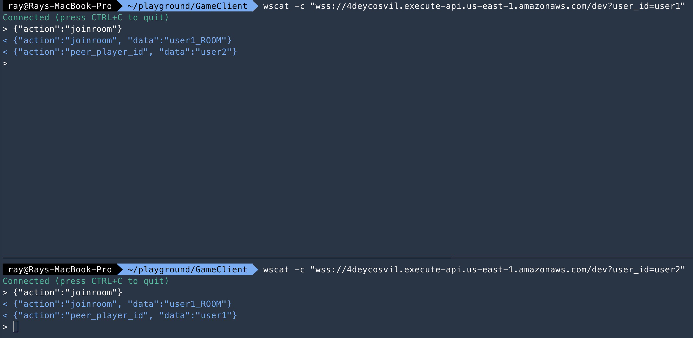

check the log of lambda

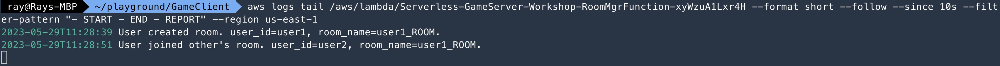

**Great, we've finished developing joinroom**


### 4. Battle Service

#### 4.1 Develop the battle framework

The gameplay of this workshop is 1v1 battles. The battle logic is as follows:

1. Player A can attack Player B after accumulating a certain score (the attack is forwarded by the server), and the attacked player cannot take any actions.
2. The player who dies first synchronizes their score with the server.
3. After both players have died, the server performs the battle settlement.


we will use SAM template to create following resources to implement the battle:

* 1 lambda function (BattleMgrFunction), handle the logic of battle

* 3 APIGateway routes (attack, die, syncscore), receive requests from clients for Attack, Death, and Sync Score

  * Attack: Client A sends an attack request with the user_id of the peer player. Upon receiving the request, the server sends data to the attacked player, and the attacked player will freeze in the game
  * Death: Client A sends a death request to the server, and the server processes the data and notifies client B
  * Sync Score: Client A and B notify the server of their current score whenever the score changes

* 1 APIGateway integration, associate the route with lambda

* 1 lambda permission, for APIGateway to invoke lambda

  

Edit `template.yaml`

* Role：replace with yours

```yaml
......
Resources:

	###--- HTTP Service ---###
  ......
  ###--- Websocket Service ---### 
  ......
  # Battle manager function
  BattleMgrFunction:
    Type: AWS::Serverless::Function
    Properties:
      Description: 'Battle'
      CodeUri: battle-manager/
      Handler: main.main_handler
      Runtime: python3.9
      Architectures:
        - arm64
      Role: "arn:aws:iam::123456789:role/Workshop-Lambda-Role"

  BattleMgrIntegration:
    Type: AWS::ApiGatewayV2::Integration
    Properties:
      ApiId: !Ref MainEntry
      IntegrationType: AWS_PROXY
      IntegrationUri: !Join
        - ''
        - - 'arn:'
          - !Ref AWS::Partition
          - ':apigateway:'
          - !Ref AWS::Region
          - ':lambda:path/2015-03-31/functions/'
          - !GetAtt BattleMgrFunction.Arn
          - '/invocations'
  AttackRoute:
    Type: AWS::ApiGatewayV2::Route
    Properties:
      ApiId: !Ref MainEntry
      RouteKey: "attack"
      AuthorizationType: NONE
      OperationName: AttackRoute
      Target: !Join
        - '/'
        - - 'integrations'
          - !Ref BattleMgrIntegration

  DieRoute:
    Type: AWS::ApiGatewayV2::Route
    Properties:
      ApiId: !Ref MainEntry
      RouteKey: "die"
      AuthorizationType: NONE
      OperationName: DieRoute
      Target: !Join
        - '/'
        - - 'integrations'
          - !Ref BattleMgrIntegration
  SyncScoreRoute:
    Type: AWS::ApiGatewayV2::Route
    Properties:
      ApiId: !Ref MainEntry
      RouteKey: "syncscore"
      AuthorizationType: NONE
      OperationName: SyncScoreRoute
      Target: !Join
        - '/'
        - - 'integrations'
          - !Ref BattleMgrIntegration

  BattleMgrPermission:
    Type: AWS::Lambda::Permission
    DependsOn:
      - MainEntry
    Properties:
      Action: lambda:InvokeFunction
      FunctionName: !Ref BattleMgrFunction
      Principal: apigateway.amazonaws.com
```

Create a directory named `battle-manager` in the same directory as `template.yaml`, which corresponds to the `Resources.BattleMgrFunction.Properties.CodeUri` in `template.yaml`.

Create a `main.py` in the `~/Serverless-GameServer-Workshop/battle-manager` directory, and add the `main_handler` method in the `main.py`, which corresponds to the `Resources.BattleMgrFunction.Properties.Handler`  in `template.yaml`.

~/Serverless-GameServer-Workshop/battle-manager/main.py

```python
import json

def main_handler(event, context):
    try:
        # Validate request parameters
        route_key = event.get('requestContext', {}).get('routeKey')
        connection_id = event.get('requestContext', {}).get('connectionId')
        event_body = event.get('body')
        event_body = json.loads(event_body if event_body is not None else '{}')

        if route_key is None or connection_id is None:
            return {'statusCode': 400}

        if route_key == 'attack':
            print('test attack')
            return {'statusCode': 200}

        if route_key == 'die':
            print('test die')
            return {'statusCode': 200}

        if route_key == 'syncscore':
            print('test syncscore')
            return {'statusCode': 200}

    except Exception as err:
        print(err)
        return {'statusCode': 500}
```

Run `sam sync` to synchronize the resources to the cloud.

```shell
sam sync --stack-name Serverless-GameServer-Workshop
```


#### 4.2 Functional Test

Same as chapter 3.2


#### 4.3 battle service

##### 4.3.1 helper function

Edit `~/Serverless-GameServer-Workshop/battle-manager/main.py`

some helper functions：

* replace the endpoint_url with yours

```python
...
import boto3

main_server_table = boto3.resource('dynamodb').Table('main_server')
common_resources_table = boto3.resource('dynamodb').Table('common_resources')

# get connection_id from user_id
# we use iteration here, you should use indexes in your production environment for better performance
def getConnIDFromUserID(user_id):
    connection_ids = []
    scan_response = main_server_table.scan(ProjectionExpression='connection_id')
    connection_ids = [item['connection_id'] for item in scan_response['Items']]
    for connection_id in connection_ids:
        if getUserIDFromConnID(connection_id) == user_id:
            return connection_id
    logger.error("Cannot get connection_id, user_id=%s" % (user_id))
    return -1

def server_response(connection_id, message):
    apig_management_client = boto3.client('apigatewaymanagementapi',endpoint_url="https://aabbcc.execute-api.us-east-1.amazonaws.com/dev")
    send_response = apig_management_client.post_to_connection(Data=message, ConnectionId=connection_id)

# get user_id from connection_id
def getUserIDFromConnID(connection_id):
    item_response = main_server_table.get_item(Key={'connection_id': connection_id})
    if 'Item' in item_response:
        user_id = item_response['Item']['user_id']
    else:
        user_id = None
    return user_id
  
# get room_name from user_id
def getRoomNameFromUserId(user_id):
    player_room_key = "%s_in_room" % user_id
    item_response = common_resources_table.get_item(Key={'resource_name': player_room_key})
    if 'Item' in item_response:
        room_name = item_response['Item']['room_name']
    else:
        room_name = None
    return room_name

# get peer user_id from user_id and room_name
def getPeerPlayerIDFromRoom(user_id, room_name):
    item_response = common_resources_table.get_item(Key={'resource_name': room_name})
    players_in_room = item_response['Item']['players_in_room']
    for player_id in players_in_room:
        if player_id != user_id:
            return player_id

# get battle info
def battleMgrPrecheck(connection_id):
    user_id = getUserIDFromConnID(connection_id)
    room_name = getRoomNameFromUserId(user_id)
    peer_player_id = getPeerPlayerIDFromRoom(user_id, room_name)
    return (user_id, room_name, peer_player_id)

# battle settlement
def battle_settlement(battle_players, room_name):
    user_id_1 = battle_players[0]
    user_id_2 = battle_players[1]

    in_battle_score_1 = int(common_resources_table.get_item(Key={'resource_name': "%s_in_battle_score" % user_id_1})['Item']['score'])
    in_battle_score_2 = int(common_resources_table.get_item(Key={'resource_name': "%s_in_battle_score" % user_id_2})['Item']['score'])

    winner_id = None
    if in_battle_score_1 > in_battle_score_2:
        winner_id = user_id_1
    elif in_battle_score_1 < in_battle_score_2:
        winner_id = user_id_2

    message = '{"action":"battle_settlement", "data":"UNKNOW"}'
    for user_id in battle_players:
        in_battle_score = int(common_resources_table.get_item(Key={'resource_name': "%s_in_battle_score" % user_id})['Item']['score'])
        connection_id = getConnIDFromUserID(user_id)
        if winner_id == None:
            message = '{"action":"battle_settlement", "data":"DRAW"}'
            print("Battle DRAW, user_id=%s, score=%d" % (user_id, in_battle_score))
        elif user_id == winner_id:
            message = '{"action":"battle_settlement", "data":"WIN"}'
            print("Battle WIN, user_id=%s, score=%d" % (user_id, in_battle_score))
        else:
            message = '{"action":"battle_settlement", "data":"LOSE"}'
            print("Battle LOSE, user_id=%s, score=%d" % (user_id, in_battle_score))
        server_response(connection_id, message)

    clear_battle_data(battle_players, room_name)

# clear battle data
def clear_battle_data(battle_players, room_name):
    for user_id in battle_players:
        common_resources_table.delete_item(Key={'resource_name': "%s_in_battle_score" % user_id})
        common_resources_table.delete_item(Key={'resource_name': "%s_in_battle_die" % user_id})

    with common_resources_table.batch_writer() as batch:
        item_response = common_resources_table.get_item(Key={'resource_name': room_name})
        players_in_room = item_response['Item']['players_in_room']
        for user_id in players_in_room:
            batch.delete_item(Key={"resource_name":"%s_in_room" % user_id})
        batch.delete_item(Key={"resource_name":room_name})
    print("All battle data cleared. room_name=%s, user_id=%s" % (room_name, battle_players))
```


##### 4.3.2 syncscore

Edit `~/Serverless-GameServer-Workshop/battle-manager/main.py`，expande syncscore function

```python
......
def main_handler(event, context):
    try:
				......
        if route_key == 'attack':
            ......
        if route_key == 'die':
            ......
        if route_key == 'syncscore':
            score = event_body["score"]
            user_id, room_name, peer_player_id = battleMgrPrecheck(connection_id)
            in_battle_score = "%s_in_battle_score" % user_id
            common_resources_table.put_item(Item={'resource_name': in_battle_score, 'score': score})
            peer_connection_id = getConnIDFromUserID(peer_player_id)
            message = '{"action":"player_syncscore", "data":%d}' % score
            server_response(peer_connection_id, message)
            print("[handle_syncscore]. user_id=%s, room_name=%s, current_score=%d." % (user_id, room_name, score))
            return {'statusCode': 200}

    except Exception as err:
        print(err)
        return {'statusCode': 500}
```


##### 4.3.3 attack

Edit `~/Serverless-GameServer-Workshop/battle-manager/main.py`，expande attack function

```python
......
def main_handler(event, context):
    try:
				......
        if route_key == 'attack':
            # get battle info from connection_id
            user_id, room_name, peer_player_id = battleMgrPrecheck(connection_id)
            # get connection_id of peer player id
            connection_id = getConnIDFromUserID(peer_player_id)
            # send attack
            message = '{"action":"attacked", "data":"FREEZE"}'
            server_response(connection_id, message)
            print("[handle_attack] Player be attacked. attacker_id=%s, victim_id=%s, room_name=%s." % (user_id, peer_player_id, room_name))
            return {'statusCode': 200}

        if route_key == 'die':
						......

        if route_key == 'syncscore':
            ......

    except Exception as err:
        print(err)
        return {'statusCode': 500}
```


##### 4.3.4 die

Edit `~/Serverless-GameServer-Workshop/battle-manager/main.py`，expande die function

```python
......
def main_handler(event, context):
    try:
				......
        if route_key == 'attack':
            ......

        if route_key == 'die':
            user_id, room_name, peer_player_id = battleMgrPrecheck(connection_id)
            in_battle_die = "%s_in_battle_die" % user_id
            common_resources_table.put_item(Item={'resource_name': in_battle_die, 'die': 1})
            peer_connection_id = getConnIDFromUserID(peer_player_id)
            item_response = common_resources_table.get_item(Key={'resource_name': "%s_in_battle_die" % peer_player_id})
            if 'Item' not in item_response:
                peer_connection_id = getConnIDFromUserID(peer_player_id)
                message = '{"action":"player_died", "data":"%s"}' % user_id
                server_response(peer_connection_id, message)
                print("[handle_die] Player died. died_user_id=%s, room_name=%s." % (user_id, room_name))
                return {'statusCode': 200}
            else:
                message = '{"action":"player_died", "data":"all"}'
                server_response(peer_connection_id, message)
                print("[handle_die] Player all died, start battle settlement.")
                battle_settlement([user_id, peer_player_id], room_name)
                return {'statusCode': 200}

        if route_key == 'syncscore':
            ......

    except Exception as err:
        print(err)
        return {'statusCode': 500}
```

Run `sam sync` to synchronize the resources to the cloud.

```shell
sam sync --stack-name Serverless-GameServer-Workshop
```


#### 4.4 Functional Test

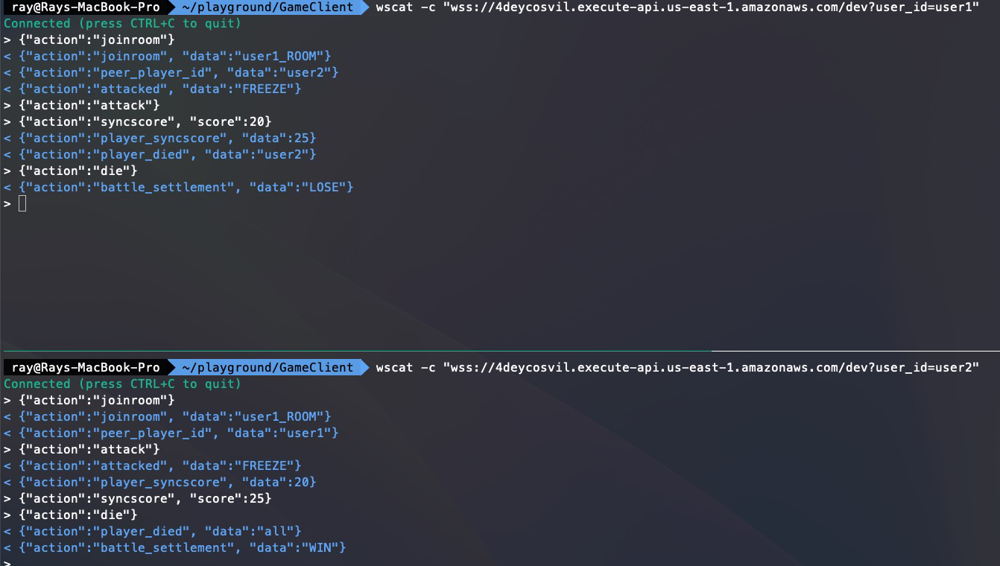

Entire battle log

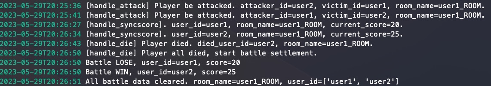

### 5. Configure Client for matchmaking and battle

**There is no packet loss retry machanism in this workshop, which may result in abnormal behavior sometimes.**


#### 5.1 Start two clients

 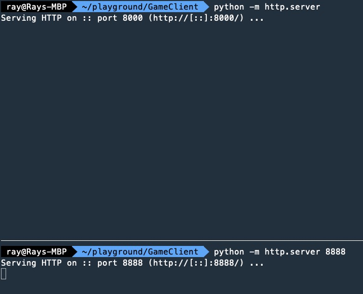

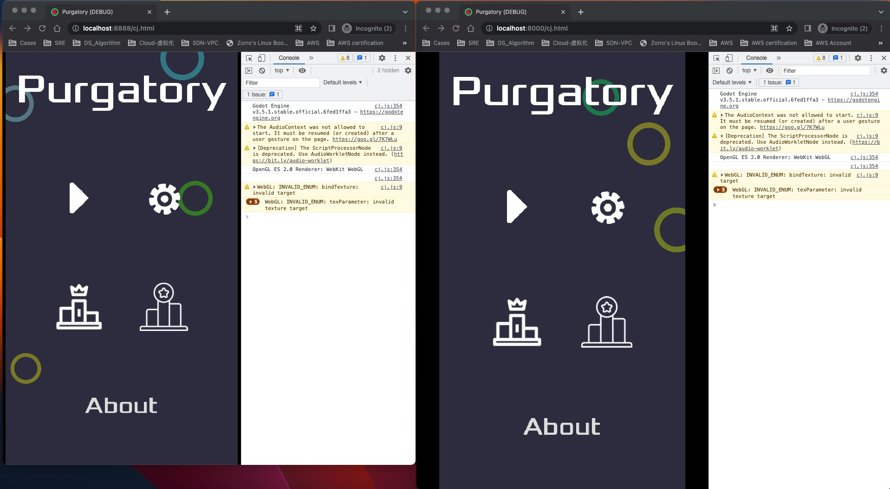

#### 5.2 Configure server addresses for two clients and create users

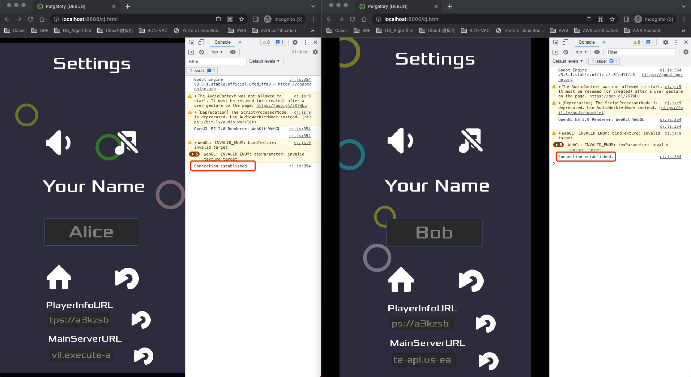

* After the user is created, the `user_id` will be automatically used as a `query_string` parameter to establish a connection with the WebSocket APIGateway.


#### 5.3 Matchmaking

Select the two-player mode for matchmaking

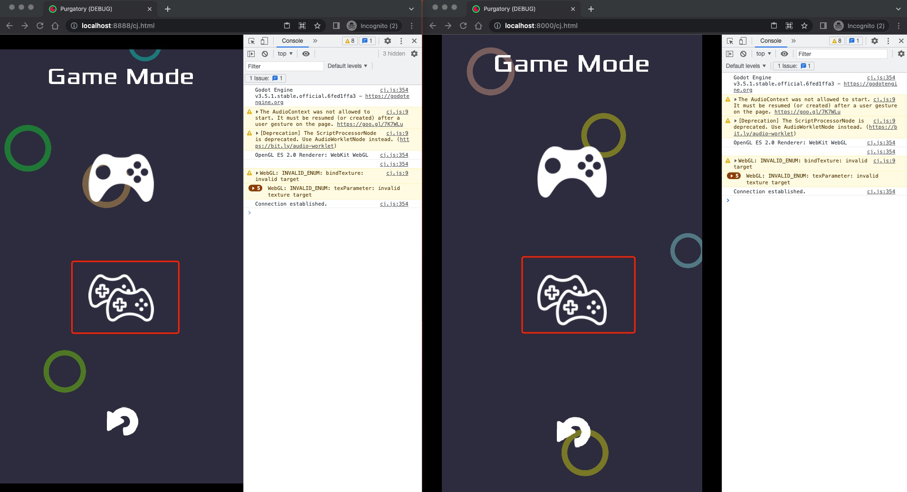

Matchmaking finished

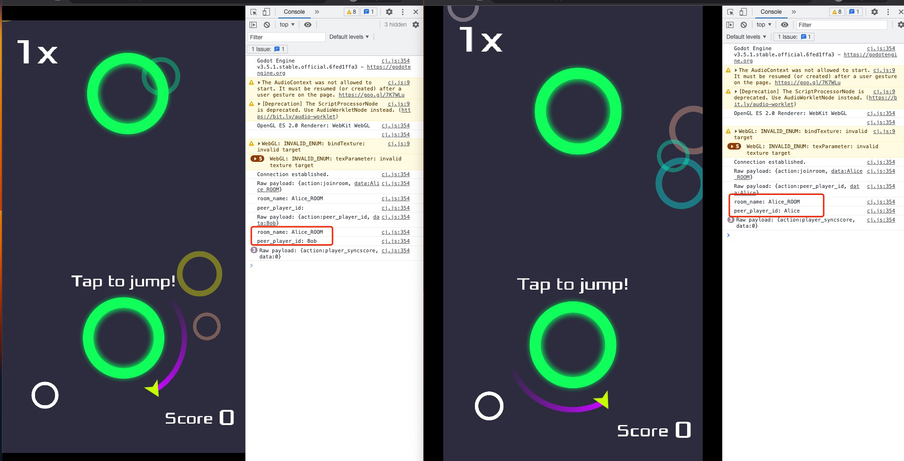


#### 5.4 Battle and battle settlement


##### 5.4.1 Draw

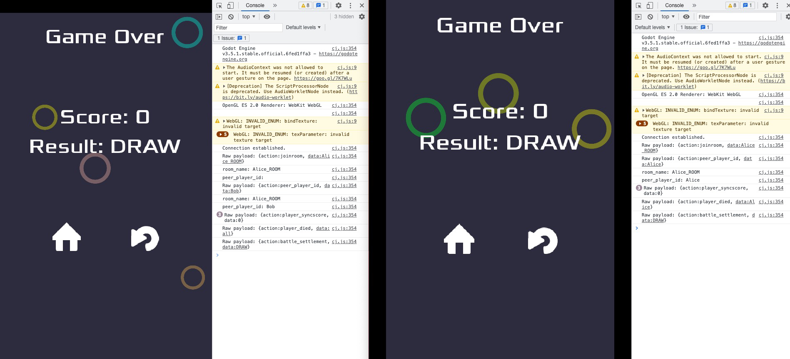


##### 5.4.2 Attack Effect

Player on the left accumulates more than 10 points, click the button in the bottom left corner to launch an attack

The player on the right will be FREEZED and unable to jump

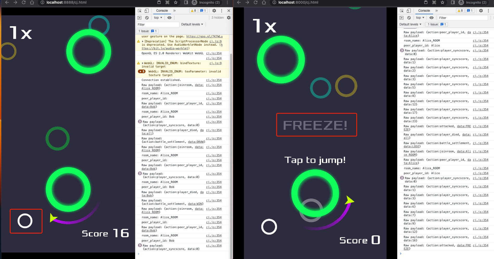

##### 5.4.3 Battle Settlement

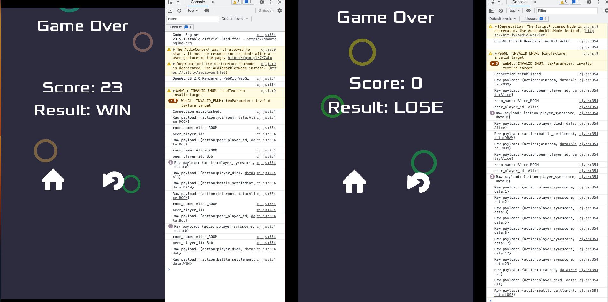
