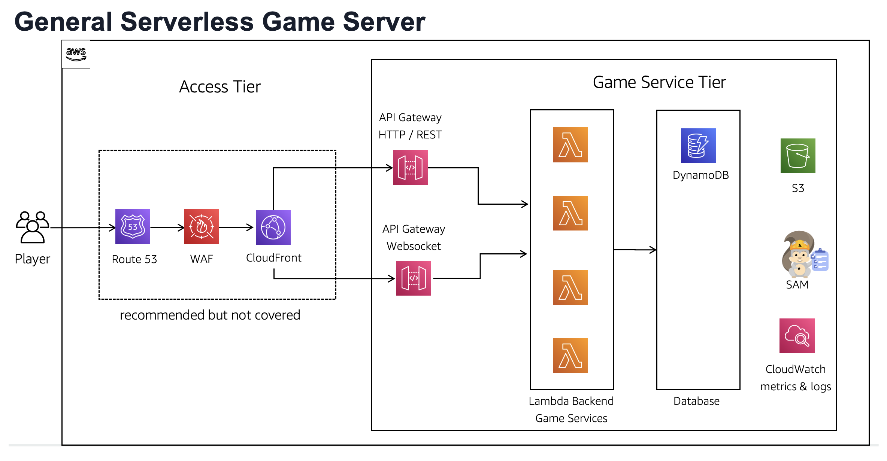
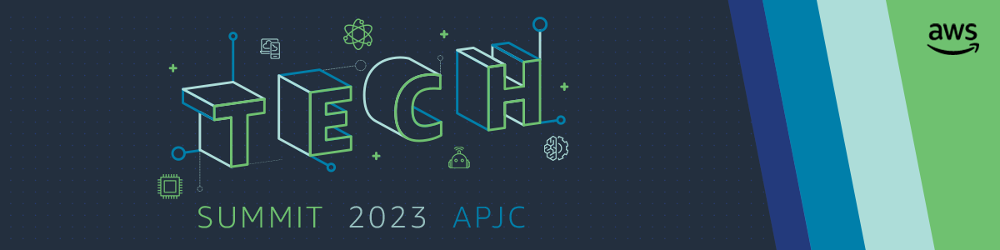

# Introduction

Welcome to the AWS Serverless GameServer workshop! In this workshop, we will explore the power of AWS serverless services to build a robust game server. By leveraging services such as API Gateway, Lambda, DynamoDB, SAM, and more, we will create a scalable and efficient game backend.

During the workshop, you will learn how to deploy and manage serverless infrastructure using AWS SAM (Serverless Application Model) templates. We will start by setting up a basic HTTP "hello world" service and gradually extend it to handle player name services and other game-specific functionalities.

Through hands-on exercises and step-by-step instructions, you will gain practical experience in developing serverless applications for game servers. We will cover topics like serverless deployment, API management, data storage with DynamoDB, and integrating different services to create a seamless gaming experience.

Whether you are a game developer or a serverless enthusiast, this workshop will provide you with valuable insights into building scalable and cost-effective game servers using AWS serverless services.

Get ready to dive into the world of serverless game development and unleash the potential of AWS services. Let's build an exciting game server together!

## Architecture Diagram

## Workshop Docs

AWS Workshop Studio: [AWS Serverless Gameserver Workshop](https://catalog.us-east-1.prod.workshops.aws/workshops/289860e1-fb72-4a89-8691-d4ded671c904/en-US/introduction)

This workshop was held at AWS 2023 APJC Tech Summit

